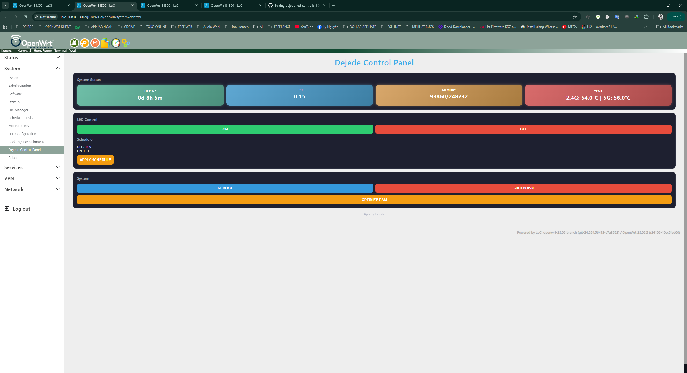

# 🚀 Dejede LED Control B1300


Custom LuCI panel untuk GL.iNet B1300 (OpenWrt)

---

## 🖥️ Preview

<p align="center">
  
</p>

---

## ✨ Features

* LED ON / OFF
* Schedule LED otomatis
* Monitoring CPU / RAM / Uptime
* Temperature WiFi 2.4G & 5G
* Reboot / Shutdown / Optimize RAM

---

## ⚡ Quick Install (1 Klik)

```bash
wget https://raw.githubusercontent.com/dejede/dejede-led-controlb1300/main/install.sh
chmod +x install.sh
./install.sh
```

---

## ⚡ Clear Cache (Jika Error)

```bash
sed -i 's/\r$//' /usr/lib/lua/luci/view/dejede/control.htm
/etc/init.d/uhttpd restart
/etc/init.d/cron restart
rm -rf /tmp/luci-*
```

---

## 🌐 Akses Panel

```
http://192.168.1.1/cgi-bin/luci/admin/system/control
```

---

## 📦 Install via IPK

```bash
opkg install dejede-control.ipk
```

---

## ⚠️ Requirement

* OpenWrt / GL.iNet firmware
* Akses root

---

## 🛠️ Troubleshooting

### ❌ Panel tidak muncul

```bash
rm -rf /tmp/luci-*
/etc/init.d/uhttpd restart
```

---

### ❌ LED tidak berfungsi

Cek path LED:

```bash
ls /sys/class/leds/
```

---

### ❌ Temperature tidak muncul

Beberapa device memiliki path sensor berbeda

---

## 📂 Struktur Project

```
dejede-led-controlb1300/
├── Makefile
├── install.sh
├── assets/
│   ├── b1300_1.png
│   └── b1300_2.png
└── files/
    └── usr/
        └── lib/
            └── lua/
                └── luci/
                    ├── controller/dejede/control.lua
                    └── view/dejede/control.htm
```

---

## 👨‍💻 Author

Dejede
